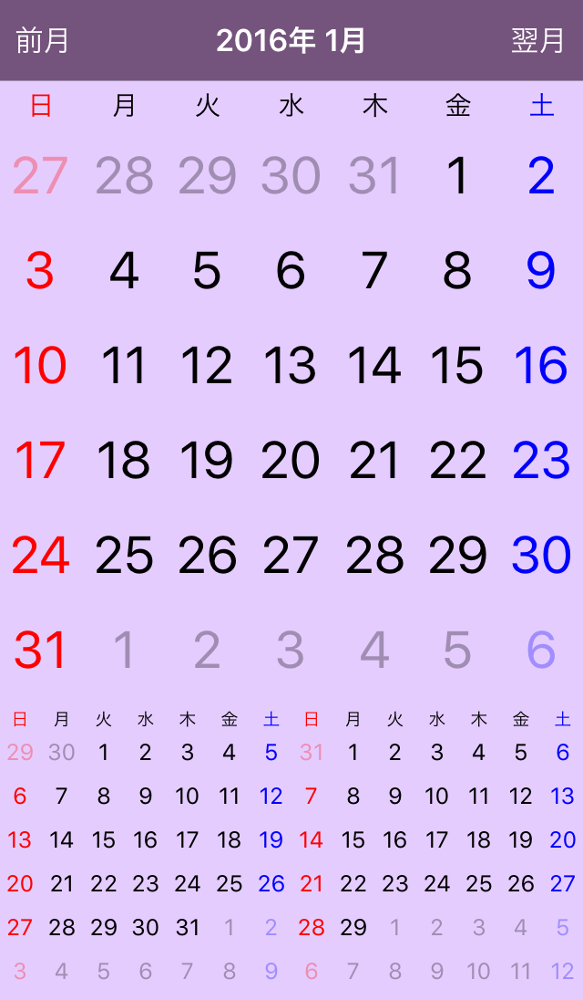

CalendarKit
===========

UICollectionView を利用したカレンダーの基本フレームワーク。Xcode のプロジェクト一式を登録してあるので、実行すればシミュレータ上でデモアプリを確認可能。カレンダー表示のみの基本機能の実装なので、日にちの領域にアイコンなどを表示したい場合は、UICollectionViewCell のサブクラスの DayCollectionCell クラスを改良すればよい。必要に応じて機能を追加して、自分好みのフレームワークにしましょう。

フレームワークの使い方は、CalendarKitDemo のソースコードを参照せよ。

Features
========

 - 今月／前月／翌月表示用メソッドあり
 - 日にちのタップを delegate を利用して NSDate 型で取得可能
 - 背面に透過した「月」表示が可能
 - 日にちの色指定用 property が利用可能

Requirements
============

 - ARC
 - Objective-C
 - iOS 9.x
 - Xcode 7.x

Screenshot
============

License Agreement
============

Copyright (c) 2016, Kouichi ABE (WALL)
All rights reserved.

Redistribution and use in source and binary forms, with or without
modification, are permitted provided that the following conditions are met:

* Redistributions of source code must retain the above copyright notice, this
  list of conditions and the following disclaimer.

* Redistributions in binary form must reproduce the above copyright notice,
  this list of conditions and the following disclaimer in the documentation
  and/or other materials provided with the distribution.

THIS SOFTWARE IS PROVIDED BY THE COPYRIGHT HOLDERS AND CONTRIBUTORS "AS IS"
AND ANY EXPRESS OR IMPLIED WARRANTIES, INCLUDING, BUT NOT LIMITED TO, THE
IMPLIED WARRANTIES OF MERCHANTABILITY AND FITNESS FOR A PARTICULAR PURPOSE ARE
DISCLAIMED. IN NO EVENT SHALL THE COPYRIGHT HOLDER OR CONTRIBUTORS BE LIABLE
FOR ANY DIRECT, INDIRECT, INCIDENTAL, SPECIAL, EXEMPLARY, OR CONSEQUENTIAL
DAMAGES (INCLUDING, BUT NOT LIMITED TO, PROCUREMENT OF SUBSTITUTE GOODS OR
SERVICES; LOSS OF USE, DATA, OR PROFITS; OR BUSINESS INTERRUPTION) HOWEVER
CAUSED AND ON ANY THEORY OF LIABILITY, WHETHER IN CONTRACT, STRICT LIABILITY,
OR TORT (INCLUDING NEGLIGENCE OR OTHERWISE) ARISING IN ANY WAY OUT OF THE USE
OF THIS SOFTWARE, EVEN IF ADVISED OF THE POSSIBILITY OF SUCH DAMAGE.

