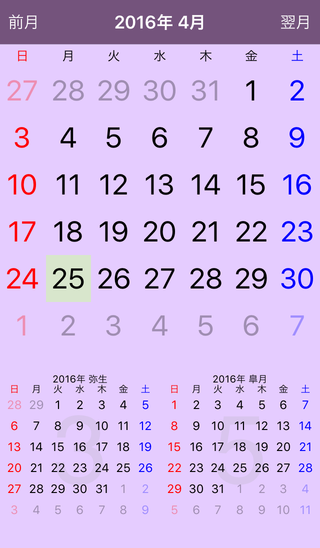

CalendarKit
===========

UICollectionView を利用したカレンダーの基本フレームワーク。Xcode のプロジェクト一式を登録してあるので、実行すればシミュレータ上でデモアプリを確認可能。日にちの領域にアイコンなどを表示したい場合は、UICollectionViewCell のサブクラスの DayCollectionCell クラスを改良すれば良い。

Features
========

 - 今月／前月／翌月表示用メソッド実装済み
 - 日にちのタップを delegate を利用して NSDate 型で取得可能

Requirements
============

 - ARC
 - Objective-C
 - iOS 9.x
 - Xcode 7.x

Screenshot
============

